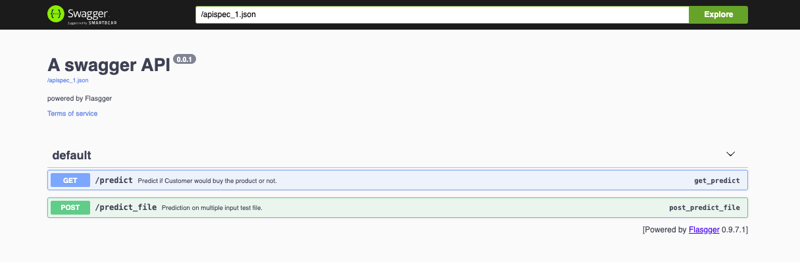
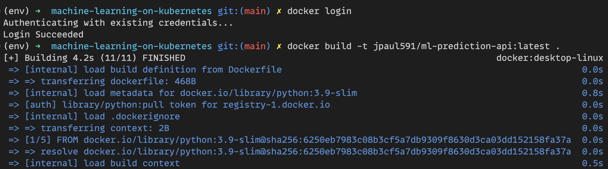
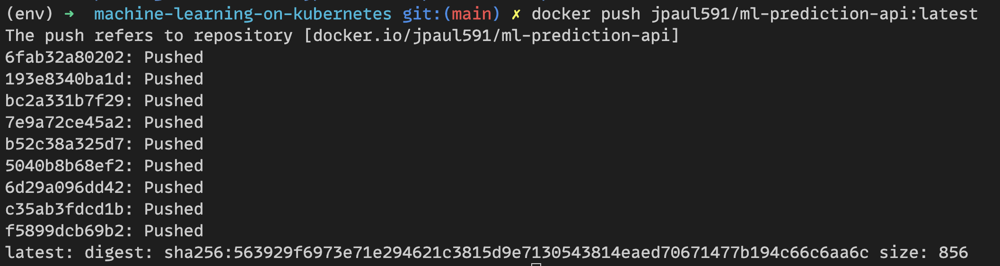
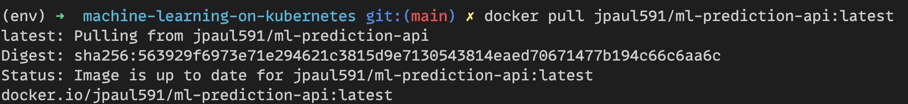
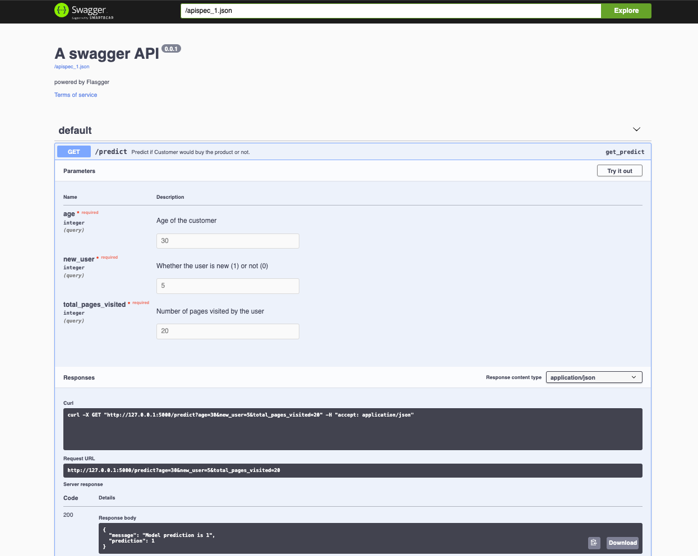
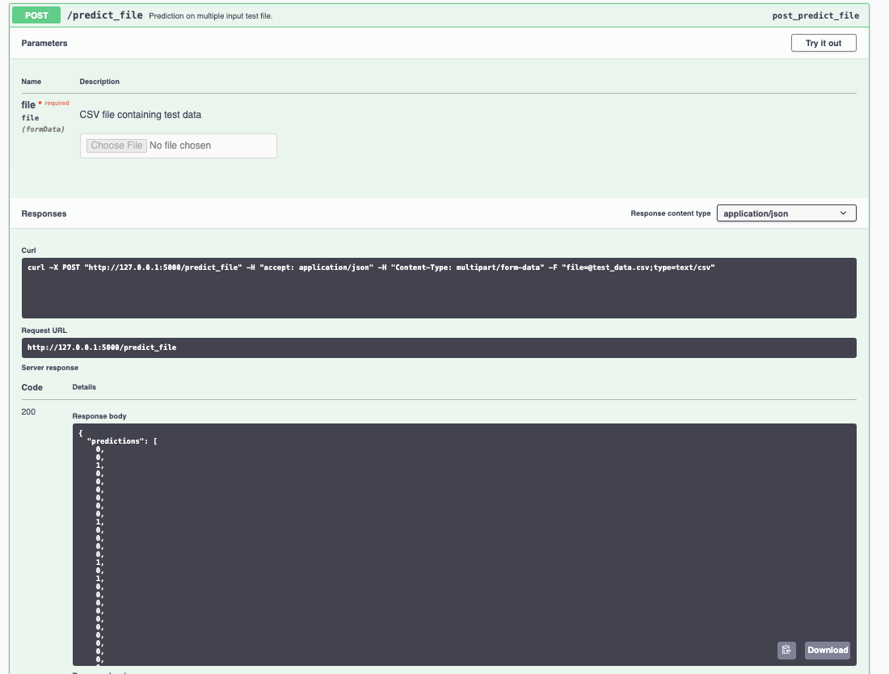
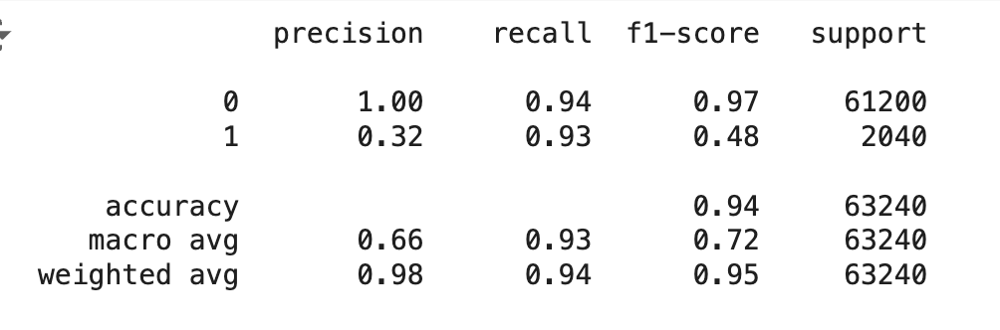

# Customer Behavior Prediction Model

## Overview
A Flask-based web application that predicts customer purchase behavior using machine learning. The model analyzes customer attributes to predict whether they will make a purchase, exposed through RESTful APIs with Swagger documentation.


## Features
- Real-time prediction for individual customers
- Batch predictions using CSV files
- Interactive Swagger UI for API testing
- Containerized deployment with Docker
- Model trained on historical customer transaction data

## Installation

### Local Setup
1. Clone the repository:
```bash
git clone https://github.com/juma-paul/cloud-computing-infrastructure/tree/main/machine-learning-on-kubernetes
cd machine-learning-on-kubernetes
```

2. Create and activate virtual environment:
```bash
python -m venv env
source env/bin/activate 
```

3. Install dependencies:
```bash
pip install -r requirements.txt
```

### Docker Setup
1. Build the image:


2. Push image to docker hub


3. Pull image to local directory


4. Run the container:


## Usage

### API Endpoints

#### 1. Single Customer Prediction
- **Endpoint**: `/predict`
- **Method**: GET
- **Parameters**:
  - `age`: Customer's age (integer)
  - `new_user`: Whether customer is new (1) or returning (0)
  - `total_pages_visited`: Number of pages viewed
- **Example**:


#### 2. Batch Predictions
- **Endpoint**: `/predict_file`
- **Method**: POST
- **Input**: CSV file with columns: age, new_user, total_pages_visited
- **Example**:



## Model Performance


## Contributing
1. Fork the repository
2. Create your feature branch
3. Commit your changes
4. Push to the branch
5. Open a Pull Request

## License
Distributed under the MIT License. See `LICENSE` for more information.

## Contact
Project Link: [Machine Learning on Kubernetes](https://github.com/juma-paul/cloud-computing-infrastructure/tree/main/machine-learning-on-kubernetes)

Presentation: [Link to slides](https://docs.google.com/presentation/d/18tJmhKejFPwaUoZ--9de4xSbr5Azn82QSHSwrBilxUU/edit?usp=sharing)