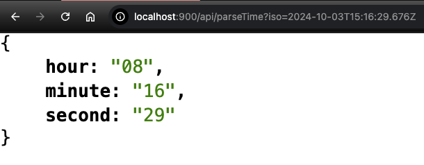
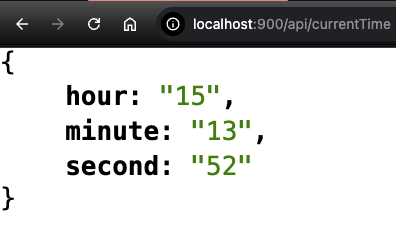
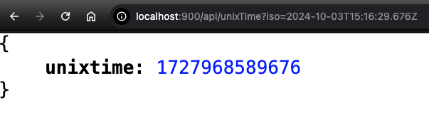
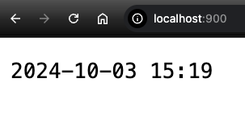
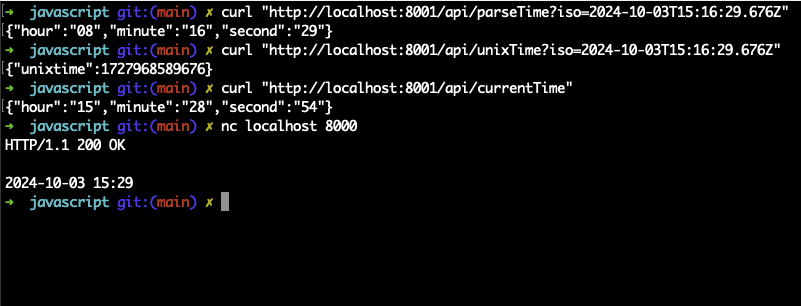

# Node.js Time API Server

## Presentation
Please find link to the presentation slides [here](https://docs.google.com/presentation/d/1SHUSUoyc_xOCujCAb-9de0ei5VTxWQjPNLvT9RF3I-k/edit?usp=sharing)

## Introduction
This project consists of two Node.js modules that work together to provide time-related API services:

1. Time TCP Server
2. HTTP JSON API Server

## 1. Time TCP Server (`timeTcpServer.js`)

This module creates a simple TCP server that responds with the current date and time when a client connects.

### Features

- Provides current timestamp in the format: YYYY-MM-DD HH:MM
- Listens on a specified port

### Usage

```bash
node timeTcpServer.js <port>
```

Replace `<port>` with the desired port number.

## 2. HTTP JSON API Server (`httpTimeApiServer.js`)

This module creates an HTTP server that provides various time-related API endpoints.

### Features

- Parse ISO time strings
- Convert time to Unix timestamp
- Provide current time

### API Endpoints

1. `/api/parseTime?iso=<ISO-time-string>`
   - Returns JSON object with hour, minute, and second
2. `/api/unixTime?iso=<ISO-time-string>`
   - Returns JSON object with Unix timestamp
3. `/api/currentTime`
   - Returns current time as a JSON object with hour, minute, and second

### Usage

```bash
node httpTimeApiServer.js <port>
```

Replace `<port>` with the desired port number.

## Installation

1. Clone the repository:
   ```bash
   git clone https://github.com/juma-paul/cloud-computing-infrastructure.git
   cd nodejs-time-api-server
   ```

2. Install dependencies:
   ```bash
   brew install node on mac # For windows, download node from the official node website
   ```

## Running the Servers

1. Start the Time TCP Server:
   ```bash
   node timeTcpServer.js 8000
   ```

2. Start the HTTP JSON API Server:
   ```bash
   node httpTimeApiServer.js 8001
   ```

## Testing

You can test the HTTP JSON API Server using curl or a web browser:

```bash
curl "http://localhost:8001/api/parseTime?iso=2024-10-03T15:16:29.676Z"
curl "http://localhost:8001/api/unixTime?iso=2024-10-03T15:16:29.676Z"
curl "http://localhost:8001/api/currentTime"
```

For the Time TCP Server, you can use a TCP client or the `nc` (netcat) command:

```bash
nc localhost 8000
```

## Demo






## Contributing

Contributions are welcome! Please feel free to submit a Pull Request.

## License

This project is open source and available under the [MIT License](https://opensource.org/licenses/MIT).